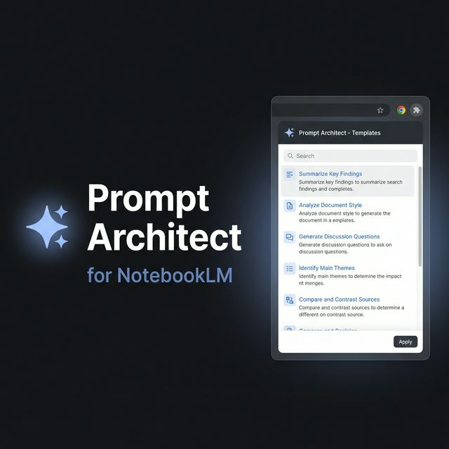
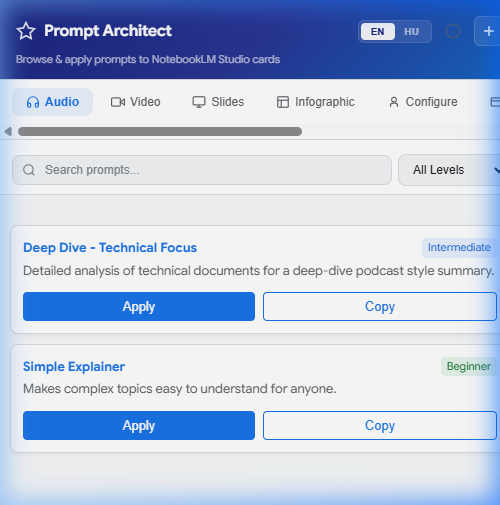
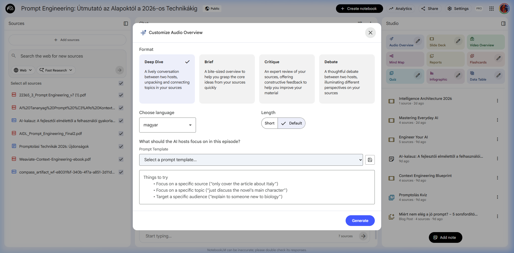
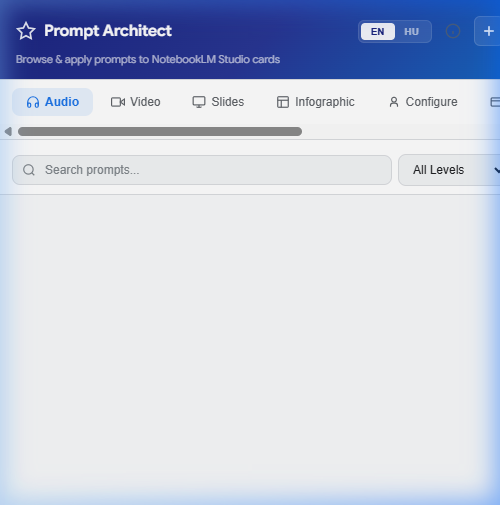
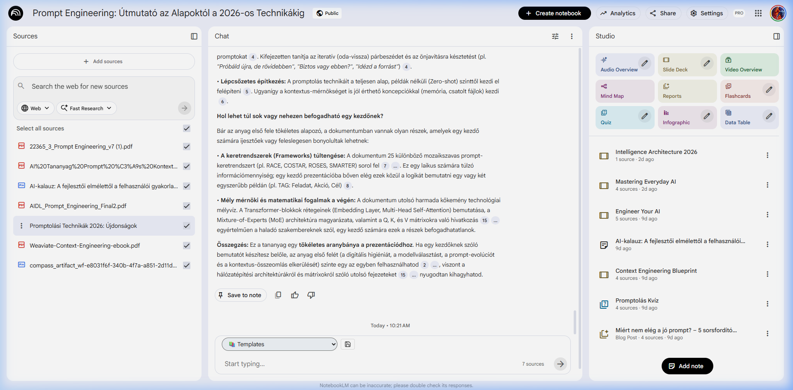

<div align="center">



# Prompt Architect for NotebookLM

**A browser extension that brings 229 curated, multilingual prompt templates directly into Google NotebookLM's Studio panels and chat input — without leaving the page.**

[](LICENSE)
[](CHANGELOG.md)
[](https://developer.chrome.com/docs/extensions/)
[](https://notebooklm.google.com)
[](#-internationalization)

<br>

[🚀 Install](#-installation) · [📖 How to Use](#-how-to-use) · [✍️ Write Templates](#️-writing-your-own-templates) · [☕ Buy Me a Coffee](https://buymeacoffee.com/arlinamid)

</div>

---

## 📸 Screenshots

<table>
  <tr>
    <td align="center" width="50%">
      
      <em>Browse & filter 229 prompt templates in the popup</em>
    </td>
    <td align="center" width="50%">
      
      <em>Template dropdown injected into the Audio Overview dialog</em>
    </td>
  </tr>
  <tr>
    <td align="center" width="50%">
      
      <em>Clean popup UI with format tabs, search, and filters</em>
    </td>
    <td align="center" width="50%">
      
      <em>Works seamlessly inside NotebookLM Studio</em>
    </td>
  </tr>
</table>

---

## ✨ Features

| | Feature | Details |
|---|---|---|
| 🎯 | **Studio Integration** | Injects template dropdowns into Audio, Video, Slides, Infographic, Configure Chat, Flashcards, Quiz, Report, and Data Table panels |
| 💬 | **Chat Templates** | Adds a compact template selector above the NotebookLM chat input |
| 📚 | **229 Templates** | 114 English + 115 Hungarian prompts across 10+ categories |
| 🌍 | **Bilingual UI** | Full EN / HU interface with one-click language switching |
| 🌙 | **Auto Dark/Light Mode** | Completely adapts to OS theme — no manual toggle needed |
| ✏️ | **Custom Prompts** | Create, edit, and delete your own prompt templates |
| 📋 | **Copy to Clipboard** | One-click copy of any prompt |
| ℹ️ | **About Panel** | Developer info, GitHub, and Buy Me a Coffee links |

---

## 🚀 Installation

> **Official Listing:** [Available on the Chrome Web Store](https://chromewebstore.google.com/detail/prompt-architect-for-note/hbojldopcfiblmknflcfedcdapmnmapm?hl=en&authuser=0)

### Step 1 — Download

```bash
git clone https://github.com/arlinamid/notebooklm-browser-plugin.git
cd notebooklm-browser-plugin
```

Or download the [latest ZIP release](https://github.com/arlinamid/notebooklm-browser-plugin/releases/latest) and extract it.

### Step 2 — Build Templates

```bash
node scripts/build-templates.js
```

> Generates `data/templates.json` from the Markdown template files.

### Step 3 — Load in Chrome

1. Open **`chrome://extensions/`**
2. Enable **Developer Mode** (toggle in the top-right corner)
3. Click **"Load unpacked"**
4. Select the project root folder (`notebooklm-browser-plugin/`)

### Step 4 — Use It!

Navigate to [notebooklm.google.com](https://notebooklm.google.com) — the extension is now active. Click the ⭐ icon in the Chrome toolbar to open the popup.

---

## 📖 How to Use

### Using the Popup

1. **Open the popup** by clicking the extension icon in the Chrome toolbar
2. **Select a format tab** (Audio · Video · Slides · Configure · Cards · Quiz · Report · Table · Chat)
3. **Filter by category** using the chip buttons (Studio, Professional, Learning, etc.)
4. **Search** by typing in the search bar
5. Click **Apply** to paste the prompt directly into the active NotebookLM panel
6. Click **Copy** to copy the prompt text to your clipboard

### Using Studio Panel Injection

When you open a Studio panel in NotebookLM (e.g., "Customize Audio Overview"):

1. A **"Prompt Template"** dropdown appears above the text area
2. Select any template from the dropdown
3. The template text is instantly loaded into the textarea
4. Edit as needed, then click **Generate**

### Switching Languages

Click **EN** or **HU** in the popup header to switch between English and Hungarian. All UI labels and template content update instantly.

### Creating Custom Prompts

1. Click the **+** button in the popup header
2. Fill in the Title, Format, Category, Level, and Prompt text
3. Click **Save** — your prompt appears at the top of the list
4. Edit or delete custom prompts with the ✏️ and 🗑️ buttons

---

## 📁 Template Categories

| Category | Description | Example Templates |
|---|---|---|
| 🎙️ Audio | Podcast-style narration | Deep Dive, Debate, Simple Explainer |
| 🎬 Video | Visual explainer formats | Concept Vulgarisation, Innovation, Onboarding |
| 📊 Slides | Presentation structures | Pitch Deck, Training Slides |
| 🖼️ Infographic | Data visualisation | Visual Summary, Stats Overview |
| ⚙️ Configure | Chat personas / roles | Socratic Tutor, Exam Coach, Research Scientist, Creative Writer |
| 🃏 Cards | Flashcard generation | Focused Study Set, Exam Prep |
| ❓ Quiz | Knowledge testing | Multiple Choice, Open-Ended |
| 📄 Report | Structured documents | Executive Briefing, Blog Post, Competitive Intelligence |
| 📋 Table | Structured data extraction | Research Findings, Key Quotes, Comparative Analysis |
| 💬 Chat | General Q&A / productivity | Text chat prompts, productivity helpers |

---

## ✍️ Writing Your Own Templates

Templates are plain Markdown files with YAML frontmatter stored in `templates/en/` or `templates/hu/`.

### Frontmatter Schema

```yaml
---
name: "Your Template Title"
category: studio           # studio | professional | learning | critical-analysis | troubleshooting | productivity | viral
difficulty: intermediate   # beginner | intermediate | advanced
format: audio-overview     # audio-overview | video-overview | slide-deck | infographic | configure-chat | flashcards | quiz | report | data-table | text-chat
use_case: "One-line description shown in the popup"
source: Library
---
```

### Prompt Section

````markdown
## Prompt

```text
Your prompt goes here.
Use [PLACEHOLDERS] for variable parts the user should fill in.

Structure your prompt clearly with numbered steps or sections.
```
````

### Adding a Hungarian Translation

Create the same file under `templates/hu/` with the same filename but translated `name:` and prompt text. The build script will automatically pick it up.

### Rebuilding

```bash
node scripts/build-templates.js
# Then reload the extension: chrome://extensions/ → 🔄
```

---

## 🗂️ Project Structure

```
notebooklm-browser-plugin/
├── manifest.json              # Chrome Manifest V3
├── icons/                     # 16 · 48 · 128px extension icons
│
├── popup/
│   ├── popup.html             # Popup UI
│   ├── popup.css              # Dark + light theme styles
│   └── popup.js               # Popup logic — filter, search, edit
│
├── content/
│   ├── content.js             # Content script — injects into NotebookLM
│   └── content.css            # Injected element styles
│
├── data/
│   ├── templates.json         # Auto-generated template library
│   └── i18n.js                # EN + HU UI strings
│
├── templates/
│   ├── en/                    # English Markdown templates
│   └── hu/                    # Hungarian Markdown templates
│
├── scripts/
│   └── build-templates.js     # Template parser & JSON builder
│
├── docs/
│   ├── banner.png
│   └── screenshots/
│
├── CHANGELOG.md
├── LICENSE
└── README.md
```

---

## 📦 Releases

### [v1.2.0] — 2026-02-28
- 🎨 **6 new Infographic visual style templates** (EN + HU): Expressive Cubist Abstract, Geometric Mosaic, Mixed-Media Expressionist, Hybrid Conceptual Collage, Dark Neo-Noir, Brutalist Editorial
- 📖 **HU: Manga Comic infographic** — 4 variants (classic B&W, shōnen action, editorial, chibi)
- ✨ **Expanded slide-deck & visual-style prompts** (8 styles, EN + HU): single-line descriptions replaced with detailed YAML design specs (color palettes, typography, layout variations, design rules)
- 📊 Template count: 217 → 229

### [v1.1.0] — 2026-02-25
- ✨ **Cross-Device Sync:** Saved prompts and language settings are now synchronized across all devices via Chrome sync storage.
- 🔄 **Data Migration:** Automatic migration of locally saved prompts to the cloud on first run.
- 🛠️ **Refactored Selectors:** Language-agnostic selectors for all Studio cards (Audio, Video, Slides, Quiz, etc.) and chat customization.

### [v1.0.3] — 2026-02-24
- 🐛 Fixed malformed inline SVG in the floating Buy Me a Coffee widget, replacing it with the official BMC image logo to resolve console parsing errors
- ✨ Replaced the external BMC script widget with a native DOM injection to completely bypass NotebookLM's strict Content Security Policy (CSP)

### [v1.0.0] — 2026-02-24 · Initial Release

- ✅ 216 prompt templates (108 EN + 108 HU)
- ✅ Studio panel injection for all 10 NotebookLM formats
- ✅ Custom prompt CRUD
- ✅ Auto dark/light mode
- ✅ EN / HU bilingual interface
- ✅ Build tooling with CRLF normalization and `##`-safe extraction
- ✅ About panel with developer info

> See [CHANGELOG.md](CHANGELOG.md) for the full list of changes.

---

## 🛠️ Development

```bash
# Rebuild templates after adding/editing .md files
node scripts/build-templates.js

# Reload extension
# chrome://extensions/ → click 🔄 on the Prompt Architect card
```

**Debugging content script:** Open DevTools on `notebooklm.google.com` → Console → filter by `[PA]`

---

## 🤝 Contributing

Pull requests and issues are welcome! Ideas:

- New prompt templates in EN or HU
- Additional language translations
- Firefox / Edge compatibility
- Bug reports and UX improvements

---

## ☕ Support

If this extension saves you time, consider buying me a coffee!

<a href="https://buymeacoffee.com/arlinamid">
  
</a>

---

## 👤 Author

<a href="https://github.com/arlinamid">
  <br>
  <strong>János Rózsavölgyi</strong><br>
  @arlinamid · Hungary 🇭🇺
</a>

---

## 📄 License

[MIT](LICENSE) © 2026 [János Rózsavölgyi](https://github.com/arlinamid)

---

<div align="center">
  <sub>Not affiliated with or endorsed by Google LLC. NotebookLM is a trademark of Google LLC.</sub>
</div>
